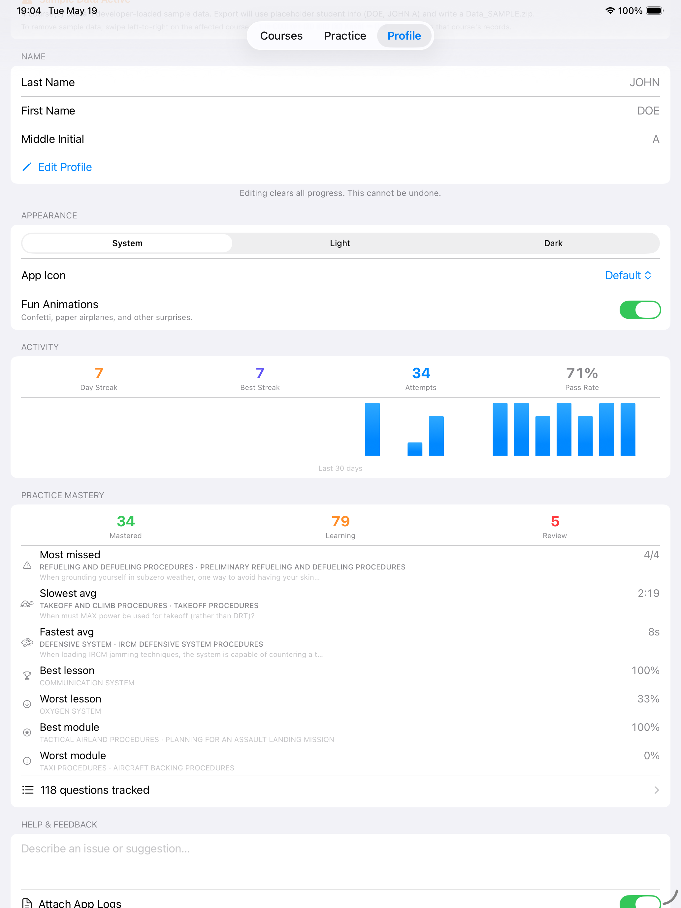
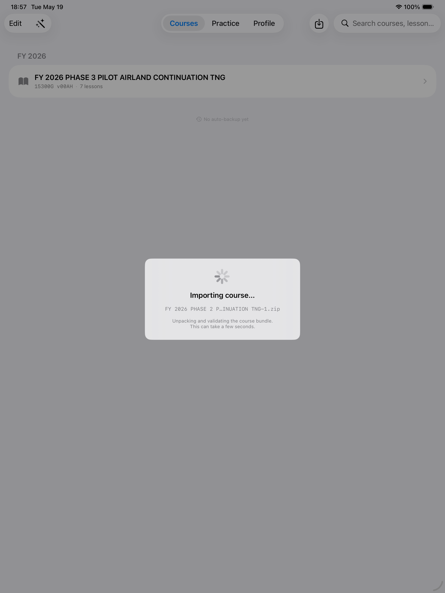
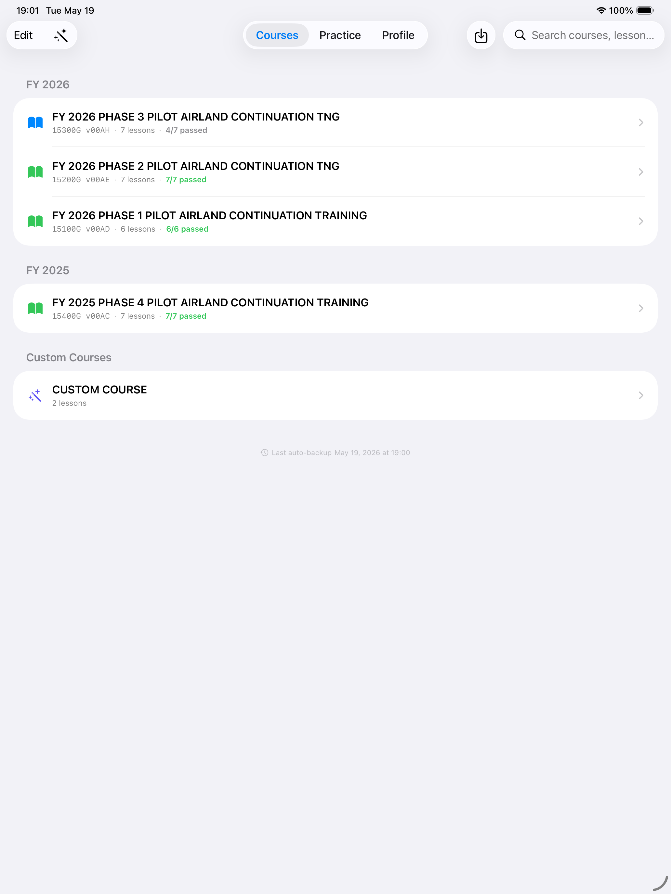
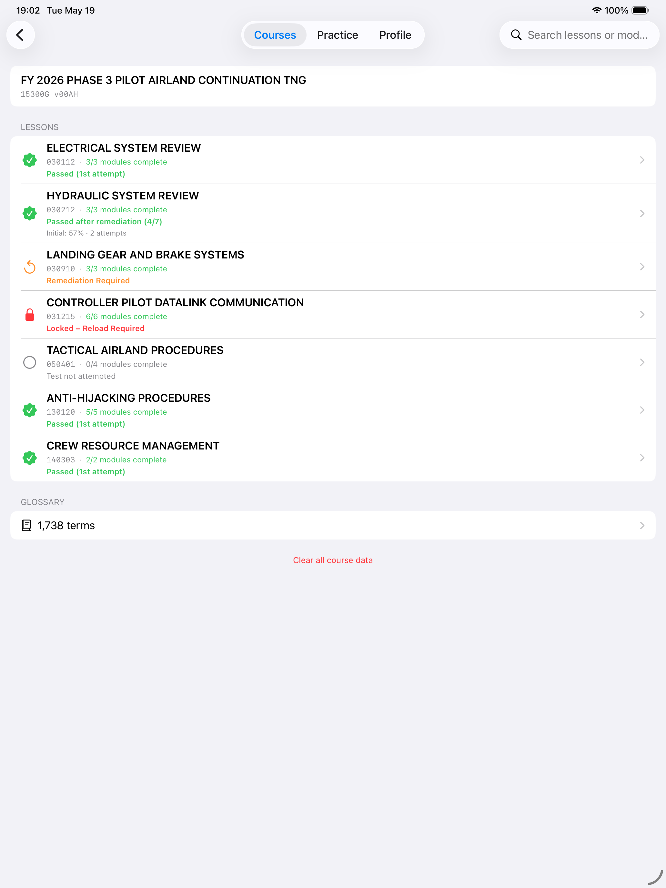
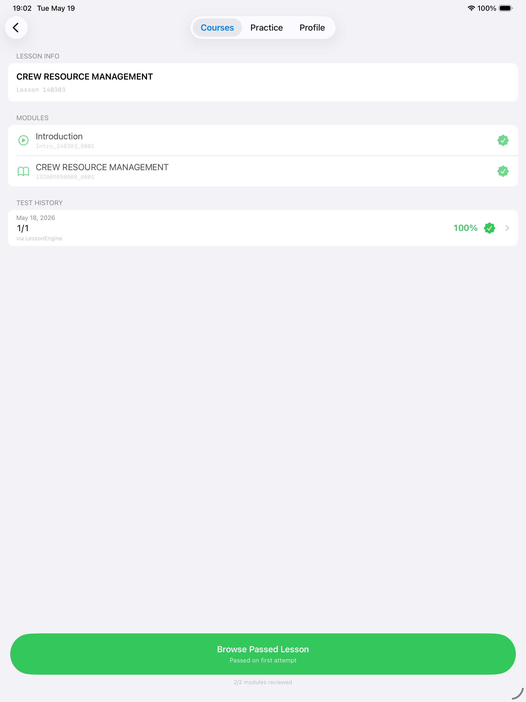
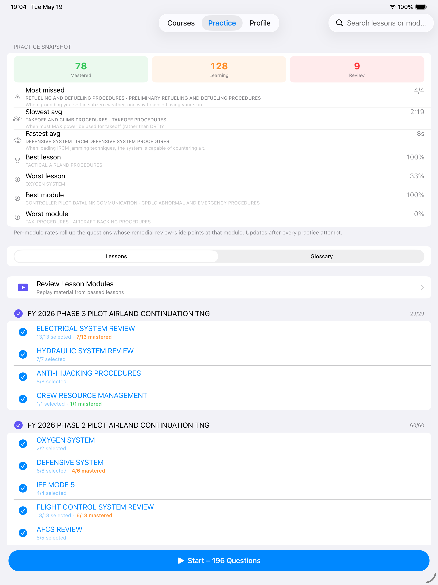
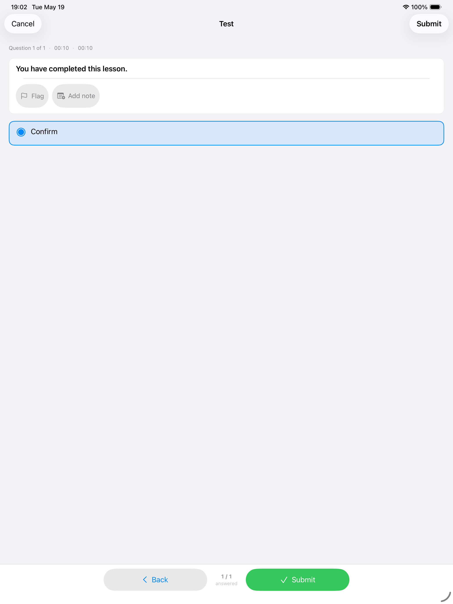
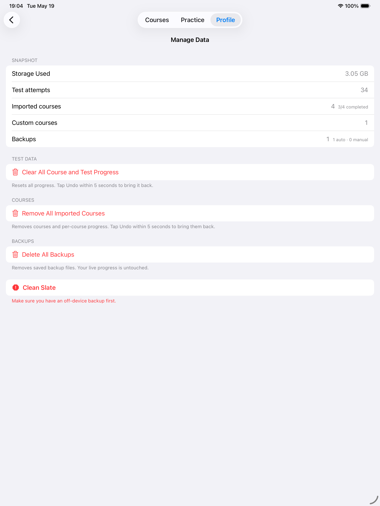

# C-17 Courseware — Support

C-17 Courseware is a native iPad and iPhone app for running C-17 Phase CBT
training packages. It imports the same course `.zip` files your unit already
distributes, plays the lessons on-device (no Flash, no desktop player), tracks
your attempts, and exports test results in the standard **TMS** format.

This page is the support reference for stakeholders running the TestFlight
build. If you have never installed a TestFlight app before, the
**Getting the app** section below walks the entire process step by step.

## Contents

1. [Getting the app via TestFlight](#getting-the-app-via-testflight)
2. [First launch](#first-launch)
3. [Loading your courses](#loading-your-courses)
4. [Working through a lesson](#working-through-a-lesson)
5. [Taking a test &amp; exporting to TMS](#taking-a-test--exporting-to-tms)
6. [Practice mode](#practice-mode)
7. [Profile &amp; data management](#profile--data-management)
8. [Updating to new TestFlight builds](#updating-to-new-testflight-builds)
9. [Troubleshooting](#troubleshooting)
10. [Contact &amp; feedback](#contact--feedback)
11. [Privacy](#privacy)

---

## Getting the app via TestFlight

C-17 Courseware is currently distributed through Apple's **TestFlight**
program for stakeholder review. TestFlight is Apple's free beta-testing
service. The full process — from invite email to a working app — takes about
two minutes.

### Step 1 — Install the TestFlight app

1. On your iPad or iPhone, open the **App Store**.
2. Search for **TestFlight** (developer: *Apple Inc.* — green icon with a
   white propeller).
3. Tap **Get** to install. It's free, and there's no setup beyond your
   existing Apple ID.

You only need to do this once per device.

### Step 2 — Accept the invitation

You will receive one of the following from the developer:

- **A TestFlight invite email** — subject line "You have been invited to test
  C-17 Courseware." Open it on the iPad/iPhone where you installed TestFlight
  and tap **View in TestFlight** (or **Start Testing**).
- **A public TestFlight link** — a URL that starts with
  `https://testflight.apple.com/`. Just tap or paste it into Safari on the
  device. TestFlight opens automatically.

If TestFlight asks you to accept the invitation, tap **Accept**.

### Step 3 — Install C-17 Courseware

TestFlight opens to a page titled **C-17 Courseware**. Tap **Install** near
the top. The app downloads to your Home screen with a small orange dot next
to its name — that dot is how TestFlight marks beta builds. The dot will
remain visible for the life of the TestFlight build.

### Step 4 — Open the app

Tap the **C-17 Courseware** icon on your Home screen. No sign-in is required.
No account exists.

That is the full installation flow. You will not be asked to create or link
any account inside C-17 Courseware itself.

---

## First launch

The app opens to a tab bar. The most important tabs for first-time setup are
**Courses**, **Practice**, and **Profile**. All three are visible at the
top (iPad) or bottom (iPhone) of every screen.

Before importing any content, jump to the **Profile** tab and enter your
**last name** and **middle initial**. Those values are used to label test
exports for TMS. They are stored only on your device.



---

## Loading your courses

C-17 Courseware ships **empty** — it does not include any training content.
You bring the course `.zip` files from your unit's archive and import them.

### Get the .zip onto your device

Any of these work:

- **P1Chat** the `.zip` from P1Chat and save to files.
- **Email** the `.zip` to yourself and save the attachment.
- **Files app** — copy the `.zip` into On My iPad / Goodreader

### Import it

1. Open C-17 Courseware and tap the **Courses** tab.
2. Tap the **import** button — the down-arrow icon in the top toolbar.
3. Pick the `.zip` in the file picker.



The course appears in the list within a few seconds, with all its lessons
and modules expanded inside. You can import as many courses as you need.



> **iPhone note:** the flow is identical on iPhone, with the tab bar at the
> bottom of the screen. Same import button (down-arrow) in the top toolbar.

---

## Working through a lesson

Tap any course in the list to see its lessons.



Tap a lesson to open it. You will see:

- The **modules** that make up the lesson (each one is a self-contained
  content block — graphics, narration, interactions).
- The lesson's **graded test**.
- A summary of your attempt history on this lesson.



Tap a **module** to play it. Modules run natively inside the app — no Flash
player, no external browser, no network call. When you reach the end of a
module, tap **Done** in the corner to return to the lesson list.

You can leave and re-open a module at any time. Progress is restored to where
you left off.

---

## Taking a test &amp; exporting to TMS

Tap **Test** on the lesson detail screen. The test plays the same way the
legacy desktop player did — one question at a time with answer choices,
navigation, and a results screen at the end.

There are **two ways** the app produces a TMS-format export, and they behave
differently. Most of the time you will only use the first one.

### 1. Automatic export when you finish a course

When you complete the **last lesson** of a course (the attempt that flips the
whole course to passed), the app:

1. Pops a dialog asking you to enter your **Student ID**.
2. Writes a TMS-format zip to the iPad's Files app at:

```
On My iPad → C-17 Courseware → Performance → <Course Title> → Data.zip
```

The file is always named exactly `Data.zip` — that is the filename TMS
expects. Completing the same course again later **overwrites** that file
with the fresh result, so the `Data.zip` in the folder is always the most
recent passing record for that course.

To hand the result off to TMS, open the **Files** app, drill down to the
course folder above, and AirDrop, email, or move `Data.zip` to wherever
your unit's TMS workflow expects it.

### 2. Manual export — "Export Results for TMS" button

On a course's main screen there is an **Export Results for TMS** button. Tap
it any time you need a fresh export — useful if you want to re-send a result
without finishing the whole course again, or if you missed the auto-export
dialog.

The app prompts for your Student ID, builds a zip named `Data.zip`, and opens
the iOS share sheet so you can AirDrop, email, or **Save to Files** yourself.
This path does **not** write to the `Performance` folder — wherever you send
it via the share sheet is the only copy.

### Which one should I use?

- **First time finishing a course (or refreshing the official record)** →
  just complete the last lesson; the auto-export drops `Data.zip` into
  `Performance/<Course Title>/` and is the recommended path of record.
- **Need to resend a result somewhere specific (different folder, AirDrop
  to a co-worker, attach a different Student ID, etc.)** → use the
  **Export Results for TMS** button on the course screen.

---

## Practice mode

Practice mode lets you re-do questions from lessons you have already passed,
without affecting any official record. It is the recommended way to refresh
on weak areas before a re-test.



To start a practice run:

1. Tap the **Practice** tab.
2. Pick a course, then choose which lessons or modules to review.
3. Set the **question count** and optional behaviors:
   - **Smart Review** sorts questions by how much trouble they have been
     giving you — recent misses, slow responses, and repeat wrong answers
     come up first.
   - **Scramble questions and answers** turns off rote memorization by
     randomizing both the question order and the answer-choice order.
4. Tap **Start**.



Practice results are stored locally and feed back into Smart Review's
weighting, but they never produce a TMS export.

---

## Profile &amp; data management

The **Profile** tab is the home for everything that is not lesson content:

- **Edit profile** — your last name and middle initial.
- **Manage Data** — backup, restore, export, and clean-slate options.
- **Submit Feedback** — opens an email draft with the app log attached. You
  can review or redact before sending.
- **Submit Testing Log** — TestFlight builds only. A one-tap way to send a
  recent activity log to the developer.
- **Help tours** — guided coachmark walkthroughs of each screen if you want
  a refresher.
- **Theme** and **alternate app icon** — cosmetic preferences.

### Backups

The app keeps **encrypted automatic backups** of your data (AES-GCM
authenticated encryption) after every state change, retaining the three
most recent. You can also export a **manual backup** (`.cbtbk` file) any
time — useful for handing data off to a new iPad.



### Moving to a new iPad or iPhone

1. On the **old** device:
   **Profile → Manage Data → Export Backup**.
   AirDrop the resulting `.cbtbk` file to the new device.
2. On the **new** device: install C-17 Courseware via TestFlight (same
   steps as above), open the app, then
   **Profile → Manage Data → Restore Backup** and pick the `.cbtbk` file.

Your profile, imported courses, attempt history, and custom courses all
restore identically.

---

## Updating to new TestFlight builds

When the developer pushes a new build, TestFlight will either:

- **Update the app automatically** — if you have automatic updates enabled
  for TestFlight apps (TestFlight app → top-right avatar → Notifications →
  Automatic Updates).
- **Prompt you to update** — open the TestFlight app and tap **Update**
  next to C-17 Courseware.

Your imported courses, attempt history, profile, and backups all persist
across updates. You will **not** need to re-import any courses after an
update.

> **Build expiration:** Each TestFlight build has its own 90-day clock
> starting from the moment the developer uploads it. As long as a new build
> arrives at least once every 90 days, the clock effectively resets each
> time you update — testers rarely see expiration in practice. If a build
> does expire (no update for 90+ days), TestFlight shows "Build expired" and
> the Home-screen icon is greyed out. The next build arrives through the
> same TestFlight channel and you install it the same way.

---

## Troubleshooting

### A course-completion zip is missing from the Files app

The automatic export only writes when **every** lesson in the course has a
passing attempt — i.e., the course flips from "in progress" to "fully
passed." If you have finished what you think is the last lesson but no
dated zip appears under
**Files → On My iPad → C-17 Courseware → Performance → &lt;Course Title&gt;**:

1. Open **Profile → Manage Data** and confirm every lesson in the course
   shows a passing attempt in the snapshot row at the top. If any lesson
   is still marked incomplete, re-take and pass that lesson first — the
   auto-export will fire on the attempt that completes the course.
2. If the course is fully passed but the dialog asking for your Student ID
   never appeared, force-close the app (swipe up from the bottom and flick
   the C-17 Courseware card away) and reopen it. The completion check
   re-runs on next launch.
3. As a workaround you can also tap **Export Results for TMS** on the
   course screen at any time — that uses the share sheet path and lets you
   save a fresh `Data.zip` wherever you want.
4. If the file still does not appear, use
   **Profile → Submit Feedback → Attach Logs** and the developer will
   triage.

### The app says my course `.zip` is unsupported

The app validates course structure on import. The exact failure reason is
in the import log.

1. Re-download the `.zip` from official sources to rule out a corrupted
   transfer.
2. Try importing again.
3. If it still fails, use **Profile → Submit Feedback → Attach Logs** to
   share the import log.

### The app crashes on launch

Rare. Try these in order:

1. Force-close the app and reopen it.
2. Restart the iPad or iPhone.
3. If the crash persists, contact support with your device model and iOS
   version.
4. As a last resort, delete and reinstall the app via TestFlight.
   **All data is lost unless you have a backup.**

### I forgot my profile name

Profile names are stored only on the device. If you have a recent backup
(`.cbtbk`), restore it via **Profile → Manage Data → Restore Backup**.
Otherwise, re-enter your name in the Profile tab — your attempt history
persists independently of the name field.

### TestFlight will not let me install the build

- Confirm the **TestFlight app** is installed and you are signed in with
  the Apple ID that received the invite.
- If the invite email is more than 30 days old, request a fresh one.
- If TestFlight says "build unavailable," check the TestFlight app's main
  screen for the most current build entry; the prior build may have been
  superseded.

### I do not see a TestFlight invite email

- Check spam / junk folders. The sender is `noreply@email.apple.com`.
- Confirm the invite was sent to the same Apple ID email you are signed
  into on the device.
- Ask the developer to re-send or to provide a **public link** instead.

---

## Contact &amp; feedback

The fastest paths, in order of usefulness for the developer:

1. **In-app feedback** —
   **Profile → Submit Feedback** (preferred — automatically attaches the
   app's activity log so the developer can see exactly what happened).
2. **TestFlight built-in feedback** — take a screenshot inside C-17
   Courseware, then tap **Share Beta Feedback** that appears at the
   top of the screenshot preview. TestFlight delivers screenshots and
   any optional comment directly to the developer.
3. **Email** — `<j.l.king.1000011@gmail.com>` for anything not covered
   above.

When reporting a problem, include:

- Your device model (e.g., "iPad Pro 11" 4th gen") and iOS version.
- The TestFlight build number (visible at the bottom of the **Profile**
  tab and on the TestFlight app's page for C-17 Courseware).
- A short description of what you were doing when the issue occurred.

Logs attached via **Submit Feedback** are local activity logs only — no
personal data, no analytics, no telemetry.

---

## Privacy

C-17 Courseware **collects no data and makes no network requests**. All
profiles, attempts, backups, and imported courses remain on the device. See
the [privacy policy](privacy.md) for the full disclosure.
